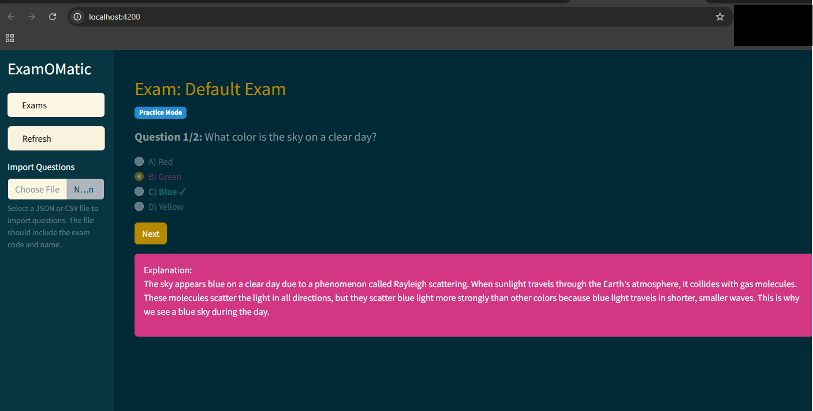

#  ExamOMatic

A simple xam practice application that allows you to import and practice exam questions.

## Features

- Import questions from JSON or CSV files
- Multiple exam support
- Practice mode with immediate feedback
- Support for multiple choice questions

## Prerequisites

- Python 3.8 or higher
- Node.js 18.x or higher
- npm (comes with Node.js)

## Installation

1. Clone the repository:
```bash
git clone <repository-url>
cd examomatic
```

2. Set up Python environment:
```bash
# Create and activate a virtual environment
python -m venv venv
source venv/bin/activate  # On Windows use: venv\Scripts\activate

# Install Python dependencies
pip install -r requirements.txt
```

3. Set up Frontend:
```bash
# Install frontend dependencies
cd frontend/exam-o-matic
npm install
cd ../..
```

## Running the Application

1. Start both services with one command:
```bash
chmod +x run.sh  # Make the script executable (only needed once)
./run.sh
```

The script will start both the backend and frontend servers. If the default ports (4200 for frontend, 8000 for backend) are in use, the script will automatically find and use the next available ports. The actual URLs will be displayed when the services start.

The script handles:
- Automatic port selection if default ports are in use
- Starting both services in the correct order
- Graceful shutdown of both services when you press Ctrl+C

Press Ctrl+C to stop both services.

## Screenshots

### Practice Mode


### Exam Mode


## File Formats

### JSON Format
Questions can be imported using JSON files. Here's the required format:

```json
{
  "exam_code": "CLF-C02",
  "exam_name": "AWS Certified Cloud Practitioner",
  "questions": [
    {
      "question": "What is the capital of France?",
      "option_a": "Berlin",
      "option_b": "Madrid",
      "option_c": "Paris",
      "option_d": "Rome",
      "correct_answer": "C"
    }
  ]
}
```

Required fields:
- `exam_code`: A unique identifier for the exam (e.g., "CLF-C02", "SAA-03")
- `exam_name`: The display name of the exam
- `questions`: An array of question objects, each containing:
  - `question`: The question text
  - `option_a` through `option_d`: The multiple choice options
  - `correct_answer`: The letter of the correct answer (A, B, C, or D)

### CSV Format
Questions can also be imported using CSV files. The CSV must have these headers:

```csv
exam_code,exam_name,question,option_a,option_b,option_c,option_d,correct_answer
CLF-C02,AWS Certified Cloud Practitioner,What is 2 + 2?,1,2,3,4,D
```

### Multiple Answer Questions
For questions that have multiple correct answers, separate the answers with commas in the `correct_answer` field:

JSON example:
```json
{
  "exam_code": "CLF-C02",
  "exam_name": "AWS Certified Cloud Practitioner",
  "questions": [
    {
      "question": "Which of these are AWS compute services? (Select all that apply)",
      "option_a": "EC2",
      "option_b": "Lambda",
      "option_c": "S3",
      "option_d": "RDS",
      "correct_answer": "A,B"
    }
  ]
}
```

CSV example:
```csv
exam_code,exam_name,question,option_a,option_b,option_c,option_d,correct_answer
CLF-C02,AWS Certified Cloud Practitioner,Which AWS services are serverless? (Select all that apply),Lambda,EC2,DynamoDB,RDS,A,C
```

Notes about multiple-answer questions:
- Use commas to separate multiple correct answers (e.g., "A,B" or "A,C,D")
- The order of answers doesn't matter ("A,B" is the same as "B,A")
- In the UI, these questions will show checkboxes instead of radio buttons
- All correct options must be selected to get the question right

### Sample Files
You can find example files in the `data` directory:
- `data/sample_questions.json`: Example JSON format
- `data/sample_questions.csv`: Example CSV format

## Importing Questions

You can import questions using either JSON or CSV format:

### JSON Format
```json
{
  "exam_code": "CLF-C02",
  "exam_name": "AWS Certified Cloud Practitioner",
  "questions": [
    {
      "question": "What is...",
      "option_a": "First option",
      "option_b": "Second option",
      "option_c": "Third option",
      "option_d": "Fourth option",
      "correct_answer": "A"
    }
  ]
}
```

### CSV Format
```csv
exam_code,exam_name,question,option_a,option_b,option_c,option_d,correct_answer
CLF-C02,AWS Certified Cloud Practitioner,What is...,First option,Second option,Third option,Fourth option,A
```

Sample files are provided in the `data` directory.

## Project Structure

```
examomatic/
├── backend/           # FastAPI backend
│   └── main.py       # Main backend code
├── data/             # Sample question files
├── frontend/         # Angular frontend
├── requirements.txt  # Python dependencies
└── run.sh           # Script to run both services
```

## Contributing

Feel free to submit issues and enhancement requests!

## License

This project is licensed under the MIT License - see the LICENSE file for details.
